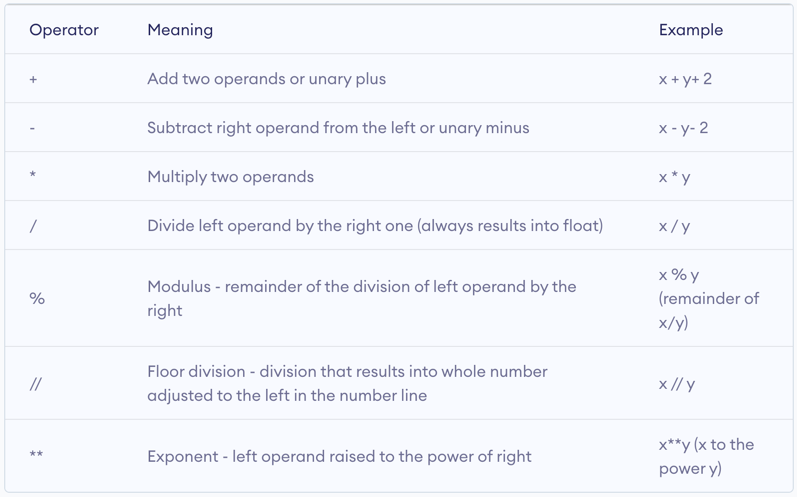
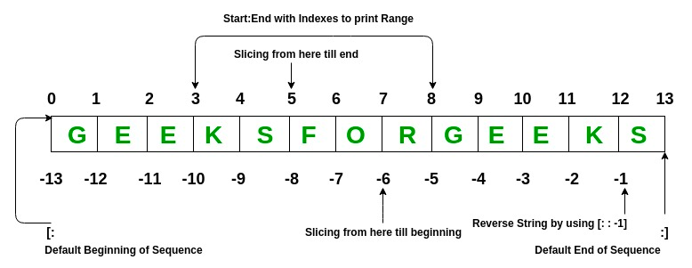
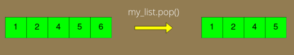
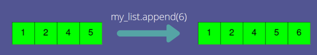
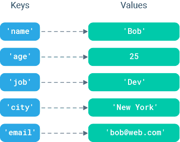

# Part 2: Basics of Python, Variables, and Basic Data Types


A few notes before we get started:
- Learning all the nuances of python takes a long time! Our goal here is to introduce you to as many concepts as possible
but if you are serious about mastering python you will need to apply yourself beyond this introduction. 
- We bring up a lot of concepts to expose you to them but we encourage you to have a "scientific" mentality and highly
encourage you to continue testing the waters beyond these materials. 
- Python can be run interactively, however, we will be saving the code to files to be run in VSCode. We will be using the "print" function to output values to the terminal.

## Variables

What is a variable? A variable is named storage that can be used to store anything from numbers to characters to much more complex data. In other languages, one needs to specify the "type" of the variable before assigning values, however, in python that is not the case. In python, a variable's type is determined by the value it is assigned. Variable names can contain only alphanumeric characters (A-Z, a-z, 0-9) and underscore (\_) and no other special characters and cannot start with a number. In the following section, you should copy and paste (or type) the code into your "helloworld.py" file and run the code each time to see the output in the terminal.

# Basic Data Types: Integers, Floating-point numbers, booleans, strings.

### Integers
whole numbers, negative or positive

```
print("Basic Data Types\n")

gene_count = 7
print("Gene count is: ")
print(gene_count)
```

### Floats
basically Real numbers

```
gene_exp = 3.89
print("Gene expression is: ")
print(gene_exp)
```

### Strings
Any text (including all symbols and spaces) is called a "string". Strings are designated by quotes around the text.

```
gene_id = "BRCA2"
print("Gene ID is: ")
print(gene_id)
hw = "HELLO!!! WORLD!!!"
print(hw)
```

#### Built-in string methods

Strings have a long list of built-in methods to return modified versions of the string. The methods do not modify the string, they return a new string.

```
tmpstr = "hello my name is Nik."

allcaps = tmpstr.upper()
print("tmpstr in all caps: ")
print(allcaps)

newstr = tmpstr.replace("Nik","Joe")
print("After replacing Nik with Joe")
print(newstr)

# This is a comment. Comments are lines that being with a hashtag symbol.
# They are ignored by the python interpreter and are used to document your code.

# you can also use the + symbol to concatenate strings
tmpstr2 = "How are you doing?"
print(tmpstr + " " + tmpstr2)

# you can find the position of one string in another
# returns -1 if not found
print("Position of 'you' in tmpstr2")
print(tmpstr2.find("you"))
print("Position of 'california' in tmpstr2")
print(tmpstr2.find("california"))
```

Here is a [list of the various methods](https://www.w3schools.com/python/python_ref_string.asp) you can use on strings.

**PRACTICE**: Take a look at the string methods and play around with them. See if you can figure out how to use the "split", "isdigit", and "index" methods.

### Booleans

"In computer science, the Boolean data type is a data type that has one of two possible values (usually denoted true and false) which is intended to represent the two truth values of logic and Boolean algebra. It is named after George Boole, who first defined an algebraic system of logic in the mid 19th century." [-wikipedia](https://en.wikipedia.org/wiki/Boolean_data_type)

```
print("\nBooleans\n")

control = False
treatment = True
print("Value of control: ")
print(control)
print("Value of treatment: ")
print(treatment)
```

Booleans come into play when making comparisons. The simplest comparisons are comparing integers:

```
print("Is 1<1?")
print(1<1)
print("Is 1<2?")
print(1<2)
print("Is 2>1?")
print(2>1)
print("Is 1<=1?")
print(1<=1)
print("Is 2>=1?")
print(2>=1)

# the double equals is an equality comparison, a single equals is for assignment.
print("Does 1 equal 1?")
print(1==1)
print("Does 0 equal 1?")
print(0==1)

# You can also do string comparisons
gene_id = "BRCA2"
hw = "HELLO!!! WORLD!!!"
print("Does gene_id equal 'BRCA2'?")
print(gene_id == "BRCA2")
print("Does hw equal 'hello'?")
print(hw == "hello")
```

## Built-in datatypes and the type function

You can use the "type" function to query the type of a variable:

```
print("The data type of the variable 'control' is:")
print(type(control))
print("The data type of the variable 'hw' is:")
print(type(hw))
print("The data type of the variable 'gene_count' is:")
print(type(gene_count))
```

Here is a list of the built-in datatypes and their corresponding category:

Text Type: str<br>
Numeric Types: int, float, complex<br>
Sequence Types: list, tuple, range<br>
Mapping Type: dict<br>
Set Types: set, frozenset<br>
Boolean Type: bool<br>
Binary Types: bytes, bytearray, memoryview<br>


# Arithmetic: Addition/subtraction, multiplication/division, assignment arithmetic (assignment operators).


```
print("\nArithmetic\n")

a = 21
b = 3

# Addition
print("a + b is: ")
print(a + b)

# "c += 5" is shorthand for "c = c + 5"
c = 83
c += 5
print("The current value of c is:", c)

# Subtraction
print("b - a is:", b - a)

# Division
print("a / b is: ")
print(a/b)

# Exponents
print("4 to the power of b is: ")
print(4**b)
#or
expb = pow(4,b)
print(expb)

# Remainder 
print("4 mod 3 is: ")
print(4 % 3)

# Absolute value
av = abs(22-32)
print("The absolute value of 22 - 32 is: ")
print(av)

# Round, Floor, Ceiling
print("3.2 rounded: ")
print(round(3.2))
print("3.2 truncated: ")
print(int(3.2))

import math
print("Ceiling of 3.2 is: ")
print(math.ceil(3.2))
print("Floor of 3.2 is: ")
print(math.floor(3.7))
print("Truncating 3.7: ")
print(int(3.7))
```

The [math package](https://docs.python.org/3/library/math.html) has many common math functions you can use.

**PRACTICE**: Add and multiply various datatypes together using conversions and math methods. Play around with other math methods. Try the "atan2" method and try the "log" method with a different base than the default.


# Basic Data Structures: Lists and Dictionaries.

**Create a new file for this section called "lists.py"**

## Lists
+  
+  
+  

```
print("\nLists\n")

gene_list = ["DDX11L1","WASH7P","MIR6859-1","MIR1302-2HG","MIR1302-2","FAM138A"]

# get the first element in the list, 0-indexed
gene1 = gene_list[0]
print("The 0th element of gene_list is: " + gene1)

# getting the last element in a list
last_gene = gene_list[-1]
print("The last element of gene_list is: " + last_gene)
# OR
last_gene = gene_list[5]
print("The element at index 5 of gene_list is: " + last_gene)

# getting a range of the list
print("Elements 1 to 3 (non-inclusive) of gene_list:", gene_list[1:3])
print("Elements -3 to end of gene_list:", gene_list[-3:])
print("Elements beginning to 3 of gene_list:", gene_list[:3])

# The same range concept works for strings
mystring = "The Quick Brown Fox"
print("Letters 4 to 9 (non-inclusive) of mystring: " + mystring[4:9])

# get the length of a list
print("The length of gene_list is", len(gene_list))

# lists can have elements of any type
gene_exp = [43.2, 45, 60.1, 12, 0.5, 23]
expval = gene_exp[2]
print("Element index 2 of gene_exp is:", expval)

# You can overwrite an element of the list
gene_list[3] = "BRCA3"
print("gene_list is now:", gene_list))

# creating a new variable equal to a list does NOT create a copy
# both variables point to the same list
gene_list2 = gene_list
gene_list2[2] = "DMR3"
print("gene_list has changed:", gene_list)

# use the copy method to make a actual copy of a list
gene_list2 = gene_list.copy()
gene_list2[2] = "DMR5"
print("gene_list:", gene_list)
print("gene_list2:", gene_list2)

# use the "in" keyword to check for membership in a list
print("Is 'BRCA2' in gene_list?: ")
print("BRCA2" in gene_list)
```
### Built-in list methods

Lists have built-in methods which WILL modify the list in place.

```
gene_list.append("BRCA2")
print("gene_list with BRCA2 appended: ")
print(gene_list)

gene_list.remove("WASH7P")
print("gene_list after removing WASH7P: ")
print(gene_list)

gene_list.reverse()
print("gene_list after reversing the list: ")
print(gene_list)
```

Here is a [list of functions and methods for lists](https://www.tutorialsteacher.com/python/list-methods).

**PRACTICE**: Play with some list methods. Try out the "pop", "insert", and "sort" methods. Try to insert a new gene name in the middle of gene_list.


## Dictionaries
- A set of key/value pairs where the keys are unique. Used primarily when you want to use a string as an index.
- Dictionary values are pointed to by the keys. Values can be anything from int, float, and bool to lists, tuples, and other dictionaries.

**Create a new file for this section called "dict.py"**



```
print("\nDictionaries\n")

gene_exp_dict = {"DDX11L1":43.2,"WASH7P":45,"MIR6859-1":60.1,"MIR1302-2HG":12,"MIR1302-2":0.5,"FAM138A":23}

# You can access a value in the dictionary by referencing the key
print("Value for key 'WASH7P: ")
print(gene_exp_dict["WASH7P"])

# You can overwrite a value
gene_exp_dict["WASH7P"] = 39
print("New value for 'WASH7P': ")
print(gene_exp_dict["WASH7P"])

# You can add a new value
gene_exp_dict["BRCA2"] = 100
print("gene_exp_dict with new key/value: ")
print(gene_exp_dict)

# dict built-in methods

# returns all the keys
print("List of keys in gene_exp_dict: ")
print(gene_exp_dict.keys())

# returns all the values
print("List of values in gene_exp_dict: ")
print(gene_exp_dict.values())

# returns all the key,value pairs
print("Key/Value pairs in gene_exp_dict: ")
print(gene_exp_dict.items())

# you can also check if a key exists in a dictionary
print("Does BRCA2 exist as a key in gene_exp_dict: ")
print("BRCA2" in gene_exp_dict)

# to make a copy of a dictionary, you need to use the "copy" method
gene_exp_dict_copy = gene_exp_dict.copy()
```

**PRACTICE**: Create a dictionary for personnel in a company where each person has a unique employee ID, and for each employee you have a name, an address, and a DOB. Populate this dictionary with at least two employees. Write the code to get the address of the 2nd employee. Create a dictionary for gene expression of multiple genes for multiple samples. Populate the dictionary with at least 3 genes for 5 samples. Write the code to get the gene expression for the 2nd gene, 4th sample.